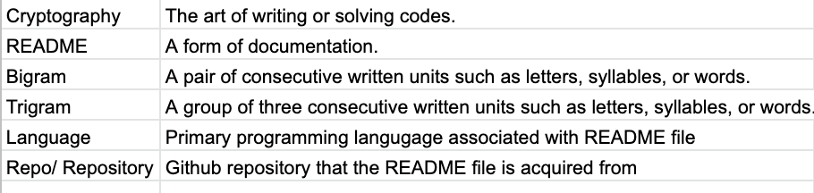

# Cryptography Repository NLP

## [Final Presentation](https://docs.google.com/presentation/d/18Wb5EudIDU5466MhY4ZSC0h1SIAOMYk88jk7FNETzL8/edit#slide=id.p)

## Executive Summary: 
- The 3 most popular programming languages used when dealing with Cryptography were:
  - Python, C++, Java
- The most common words that were used across all the README files were:
  - key, use/using, build, cryptography, test, crypto, library, hash, function, io
- The top 10 words account for 5% of the words found in README files. 
- Most common words that are related to cryptography:
  - key , cryptography, crypto, hash 
- Our K Nearest Neighbor model beat baseline with a test sample accuracy of 52.44%, which is a 192% increase in accuracy when compared to baseline. 

## Deliverables: 
- Final notebook with research process, well-labeled visualizations, models, and findings
- Link to Google Slides presentation with 2-5 slides 
- 5-6 minute presentation 

## Project Goals:
- Identify elements of a README contents in order to predict the Github repository's primary programming language. 
- Create a predictive model that can take in the text of a Github repository's README and determine that repository's primary language.

## Project Description:
- This project aimed to build a model that can predict the main programming language of a repository, given the text of a README file. The team built a dataset based on the README files of repositories dealing with Cryptography, explored different aspects of the README files, and built models that predicted the programming language used in the repository based on the README files. 

## Project Plan:
- Acquire the data from Github Repositories and store the function in the acquire.py file.
- Clean the data with functions found in the prepare.py file.
- Explore the data and ask questions to clarify what is actually happening.
  - Ensure to properly annotate, comment, and use markdowns.
  - Store functions used in a wrangle.py file for reproducability.
  - Visualize the data when applicable.
- Create a decision tree models, random forest models, and KNN models to predict the programming language given a README. 
- Create 2-5 slides in Google Slides to suitable for a general audience.
- Present 5-6 minutes to peers.

## Data Dictionary:

## Conclusion: 
- Python, C++, and Java were the three most popular programming languages used when dealing with Cryptography.
- The most common words that were used across all the README files were:
  - key, use/using, build, cryptography, test, crypto, library, hash, function, io
- The top 10 words account for 5% of the words found in README files. 
- key , cryptography, crypto, and hash were the most frequently used words that are related with Cryptography
- Our K Nearest Neighbor model beat baseline with a test sample accuracy of 52.44%, which is a 192% increase in accuracy when compared to baseline. 

## With More Time:
- Gather more README files to expand the dataset. 
  - See if there has been a shift in most frequently used programming languages, or if Python has always been the most frequently used.
  - See if the most frequently used words has changed over time
- Adjust Random Forest paramaters to see if we can improve upon our model. 

## Replicate Project: 
- Tools/Libraries:
  - Python
  - Pandas
  - Numpy
  - Sci-kit learn
  - Matplotlib
  - Seaborn
  - NLTK
  - BeautifulSoup
- Steps to recreate
  - To recreate using the same dataset found in this analysis, download csv file to your local repository
  - To recreate using the current trending repositories or other repository collections, utilize acquire.py
  - Clone this repository, including .py modules, and run the final_notebook.ipynb
